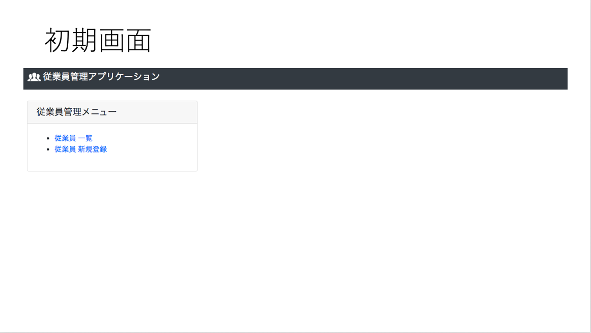
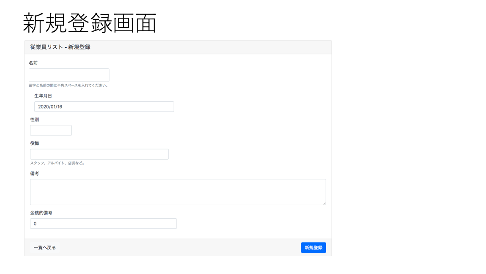
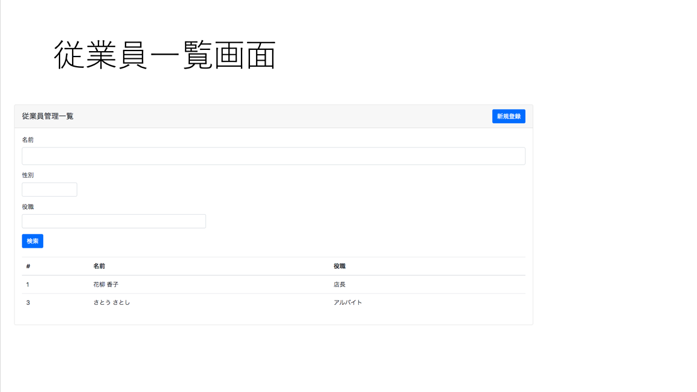
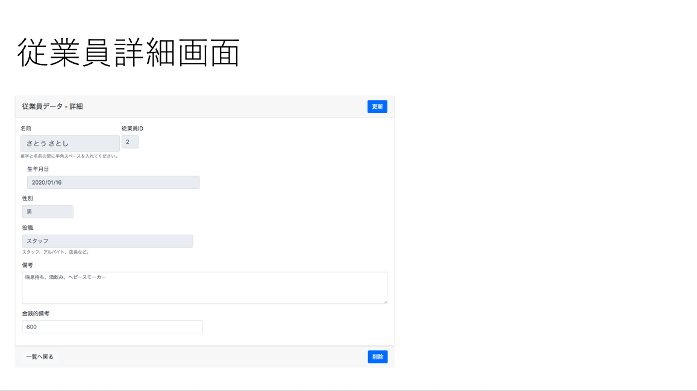
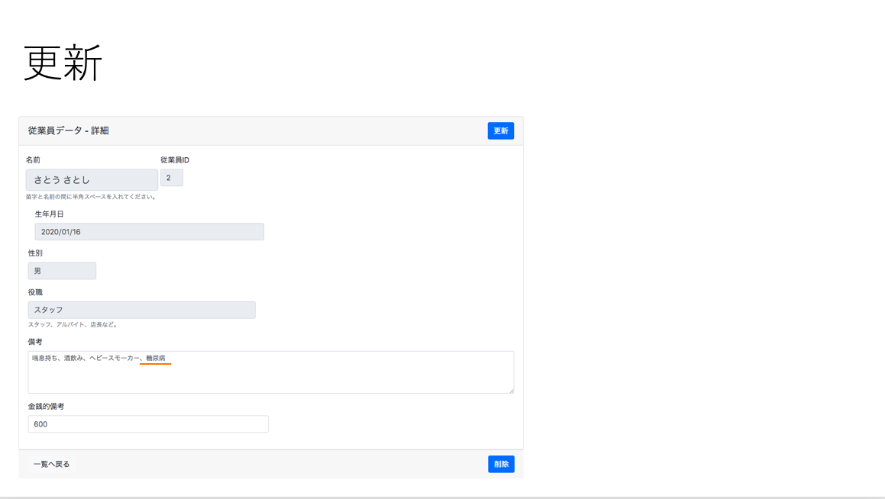

# 従業員管理アプリケーション

Docker で環境構築をし、CRUD 機能を備えた Web App

## 使用技術

- python
- mysql
- tornado
- unittest
- docker

## 環境構築

```bash
# コンテナをデタッチモード(バックグラウンド)で起動
$ docker-compose up -d --build

# コンテナ、ネットワーク、イメージの削除
$ docker-compose down --rmi all
```

## 初期画面



## 新規登録画面



## 一覧画面



## 詳細画面



## 更新画面



## 削除画面


