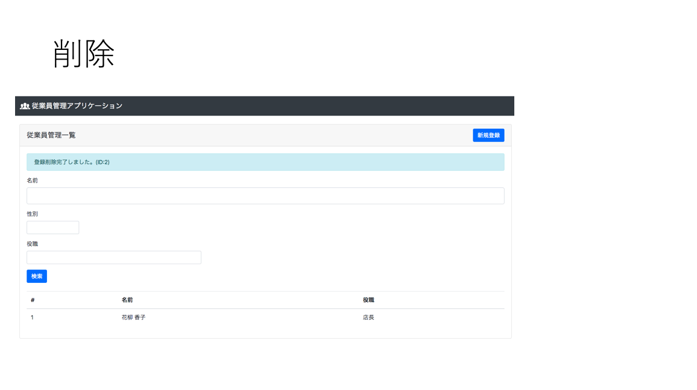

# 従業員管理アプリケーション

Docker で環境構築をし、CRUD 機能を備えた Web App

## 使用技術

- python
- mysql
- tornado
- unittest
- docker

## 環境構築

```bash
# イメージをビルドし、デタッチモード(バックグラウンド)で起動
$ docker-compose up -d --build


# コンテナ、ネットワークの削除
$ docker-compose down
# コンテナ、ネットワーク、イメージの削除
$ docker-compose down --rmi all
```

## unittest

```bash
# testsフォルダ以下をすべて実行
$ python -m unittest discover tests

# 特定の関数のみを実行
$ python -m unittest tests.test_.test_member.test_db_is_working
```

## 初期画面


## 新規登録画面


## 一覧画面


## 詳細画面


## 更新画面


## 削除画面


